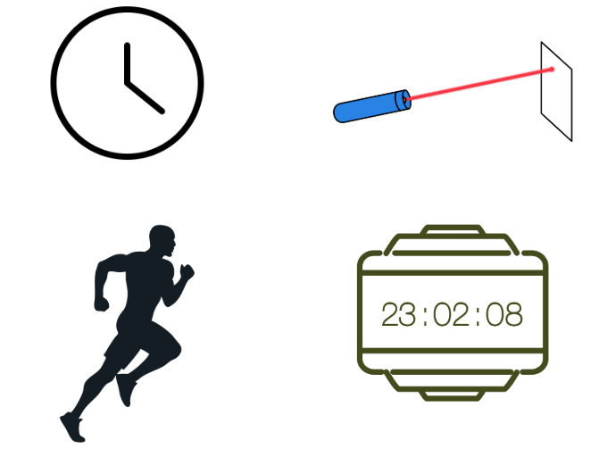
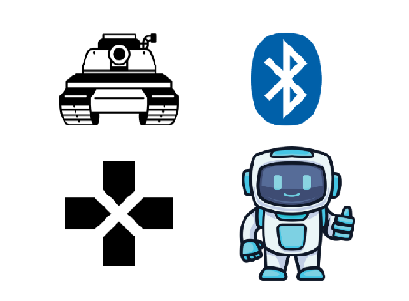
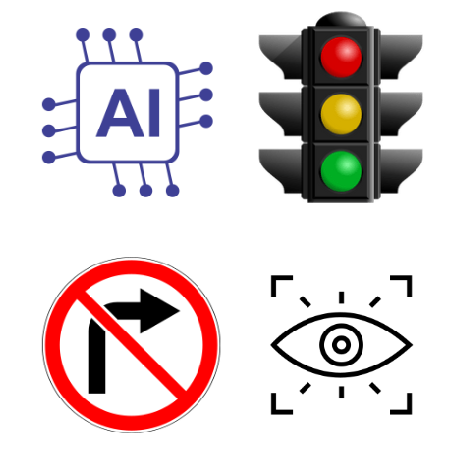

# Electronics and Computer Enginnering Student 

#### Technical Skills: AutoCAD, Altium Designer, Matlab, Vivado

## Education 
- B.S., ECE | Wroclaw University of Science and Technology

## Socials
- Linkedn| [Profile Link](https://www.linkedin.com/in/azra-selvitop-a52869223/)
- Instagram| [Profile Link](https://www.instagram.com/azra.selvitop/)

## Projects
### Subject: Optoelectronics - Project Chronometer 
[Report Link](project reports/ProjectChronometer.pdf)

### Subject: Robotics - Remotely Controlled Tank-Like Robot
[Report Link](project reports/Advanced Topics in Robotics Project Report.pdf)

### Subject: AI and Computer Vision - Traffic Light and Sign Recognition for Autonomous Vehicles
[Report Link](project reports/AInCV_project_final_report.pdf)

